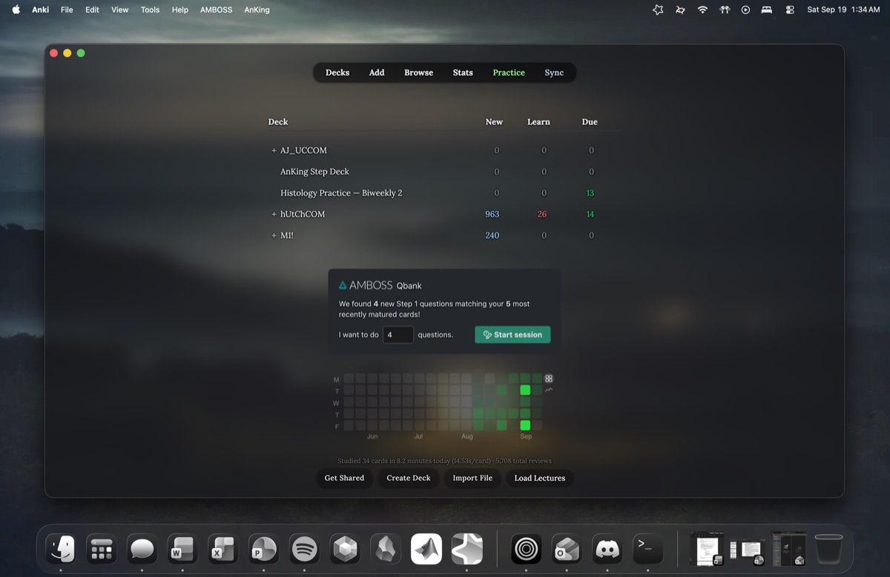
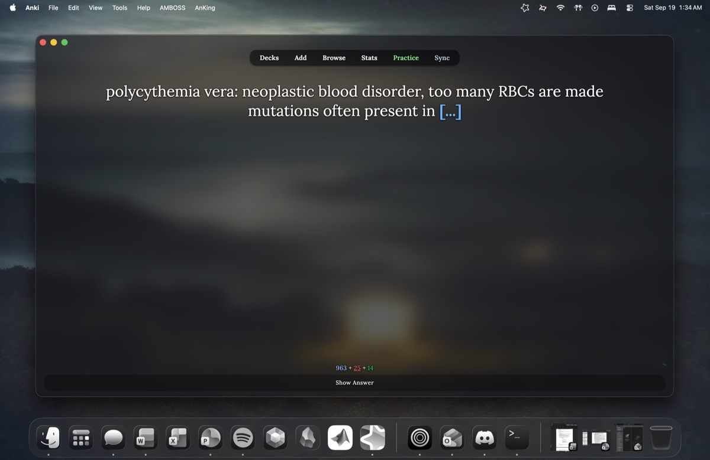
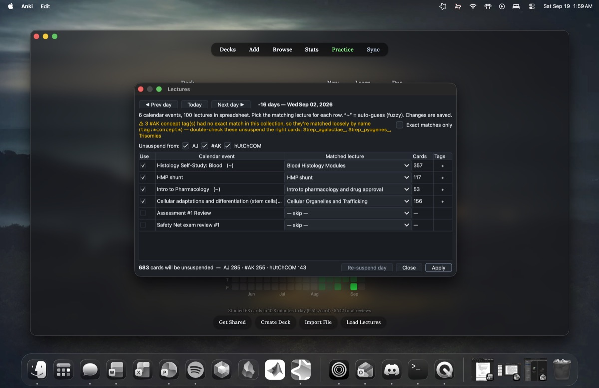

# Janki

<strong><i>A feature-rich <a href=https://github.com/ankitects/anki>Anki</a> client for MacOS, designed to expand
Anki's core functionalities and simplify student workflows.</i></strong>

  

>[!WARNING]
> Some features within this add-on are still rather experimental. Please use at your own risk!

## Install

Runs as an Anki plugin and patcher on **normal, stock Anki** — no custom build or separate app.
There are two builds — pick one (each link always downloads the latest release):

- **[⬇ Download `janki.ankiaddon`](https://github.com/cjreplogle/janki/releases/latest/download/janki.ankiaddon)**
  — the full frosted-glass experience. Adds a small, self-healing, reversible
  **patch layer** to Anki that enables the transparency (details below). I use this.
- **[⬇ Download `load-todays-lectures.ankiaddon`](https://github.com/cjreplogle/janki/releases/latest/download/load-todays-lectures.ankiaddon)**
  — a bare-bones version of the add-on that simply has the
  [Load today's lectures](docs/load-todays-lectures.md) import functionality.
  Designed for if you don't care for any of the other features.

1. **Install Anki** (if you haven't yet) from [apps.ankiweb.net](https://apps.ankiweb.net).
2. **[Download `janki.ankiaddon`](https://github.com/cjreplogle/janki/releases/latest/download/janki.ankiaddon)** (always the latest release).
3. **Double-click it** (Anki opens and installs it), or in Anki:
   **Tools → Add-ons → Install from file…** → pick the `.ankiaddon`.
4. **Restart Anki.** On first launch Janki applies a small one-time patch to Anki
   so the frosted glass can work, then asks you to **quit and reopen once**. Do
   that, and the glass is on. From then on, just open Anki normally.

> [!NOTE]
> **Why the one-time patch + restart?** True transparency needs a setting applied
> before Anki starts drawing — something an add-on alone can't do. Janki modifies
> two of Anki's own files to enable it (backups are kept), and **re-applies
> automatically after any Anki update**, prompting a quick restart when it does.

**From source (devs):** copy the files into
`~/Library/Application Support/Anki2/addons21/janki/`.

### Updating
After the first install, Janki updates itself — no more manual downloads. It
checks this repo's Releases about once a day and, when a newer version is out,
offers a one-click **Update now** (it grabs the matching build, installs it, and
keeps your settings). You can also trigger it anytime with **Tools → Janki: Check
for updates…**, or turn the auto-check off via the `auto_update_check` config.

### Uninstall
Because the glass involves a small patch to Anki's own files, remove it the clean
way: **Tools → Janki: Settings… → General → "Restore stock Anki (remove glass
patch)"**, restart, then delete the add-on from **Tools → Add-ons**. That restores
Anki's original files (repairing its signature) and clears everything Janki added,
so nothing is left behind.

> To change or disable any feature: **Tools → Janki: Settings…**

## Features

- **Frosted-glass reviewer** — revamps the Anki user interface from the ground up. Minimal, yet designed to seamlessly take advantage of modern hardware features. Includes a rework of card animations, application-wide frosted glass transparency, and much, much more...

  

    
    
  

- **Focus Mode** (**`Tab+F`**) — hides toolbar/answer bar and centers the card.
  Only has the card contents on screen. Also throws in small customizable timer
  which fills over N seconds; when it runs out a red edge-glow flares
  (a "time to move on" nudge). A green flare denotes a card as finished for the day.
- **Lockdown Mode** (`backtick/~+delete`) — locks Janki into fullscreen to keep
  you from getting distracted. Escape by holding space/the entry bind for 10s.
  Tiered into three levels depending on how cooked your attention span is from
  doom-scrolling.
  
  

    <video src="https://github.com/cjreplogle/janki/raw/master/docs/media/scroll-animations.mp4" autoplay loop muted playsinline controls width="560"></video>
  

- **Rephrase** — automatically re-word the same card
  slightly differently while retaining core information (Enable: **`Tab + R`**), so you
  don't simply memorize the card without understanding it. Automatically intersperses
  reworded cards after a single pass, while the original text is easily retrievable. All
  rephrases fall with the same card, so making headway with the adjusted wording has the
  same effect as getting the original card correct.

  **→ [How to Use Card Rephrasing](https://cjre.pl/ogle/janki/rephrase)**
- **Practice questions** — pull multiple-choice questions
  related to the card you're reviewing (**`Tab + Q`**), or load whole question banks into
  Anki as a real, syncable Practice deck. Banks are local `.qb` files; grading is by answer
  choice (correct → suspend, wrong → retry, skip → bury) with a per-bank Score. Runtime is
  100% local.
  
  **→ [Practice system + how to import a document as a question bank](docs/practice-questions.md)**
- **Mobile card theming** *(experimental, off by default)* — AnkiMobile/AnkiDroid can't run
  add-ons, so this can stamp an OLED-dark background, a serif font, and the text-reveal
  animation into your note types (scoped to mobile) so the look rides your normal sync
  to the phone/iPad. It rewrites every note type's templates, so it's opt-in: set
  `"mobile_cards": true` in the add-on config to reveal **Tools → Janki: Mobile cards**
  (Apply / Remove — one-click reversible).
  
  **→ [Mobile cards setup + recommended AnkiMobile settings](docs/mobile-cards.md)**

  

    <video src="https://github.com/cjreplogle/janki/raw/master/docs/media/mobile-cards.mp4" autoplay loop muted playsinline controls width="240"></video>
    <!-- practice mobile clip hidden for now
    <video src="https://github.com/cjreplogle/janki/raw/master/docs/media/mobile-practice.mp4" autoplay loop muted playsinline controls width="240"></video>
    -->
  

- **Load today's lectures** — reads a local `.ics`
  calendar (URL/file) and a local `.txt`/`.xlsx` lecture→tag map, finds your
  classes for the day, and adaptively unsuspends relevant tagged cards
  (AJ/#AK/Hutch decks tested). A calendar is optional — without one you pick
  lectures manually.

  **→ [Load Today's Lectures tutorial](docs/load-todays-lectures.md)**

  

    
  

  *This feature expects your own calendar export and tag map; set their paths on
  the Lectures → Sources tab (or just run **Tools → Load today's lectures** and
  pick a tag map when prompted). Nothing is uploaded — the calendar is read
  locally (a URL source is optional and fetched only if you enter one).*
- **Caption Mode** — Trying to multitask but still see your anki cards? Press **`Tab + \`**
  to change the Anki notecard view to be in "caption" form. **`Tab+Arrow Keys`**
  adjusts their screen position. Remains visible in this view even when other
  things are in fullscreen. (Note: also integrated to work & adjust with remote buttons)

  

    <video src="https://github.com/cjreplogle/janki/raw/master/docs/media/caption-mode.mp4" autoplay loop muted playsinline controls width="560"></video>
  

- **Global hotkeys & remote** — hold **Tab** as a modifier or use your
  controller to drive the reviewer even when Anki is not focused.
  (i.e. **`Tab+Z`** → again, overrides being unfocused). **`Cmd+Opt+A`** also will globally
  focus the Anki window regardless of whatever else you are doing.
- **Pomodoro** — review-time work intervals, an in-window break screen
  (hold **Space** to skip), and a calm "break due" blue edge tint.
  Toggle the whole system on/off in settings. 
- **Tray menu** — keeps Anki open in the background and allows you to navigate a
  miniaturized menu with other things focused.
- **Quick Zoom** — for whatever god forsaken reason Anki does not have **`Cmd+`**
  or **`Cmd-`** hotkeys to zoom card contents so that exists now...

## Suggested Add-Ons

These extra installs help tie together some theming:
* [Anki Redesign](https://ankiweb.net/shared/info/2119814566) (Some menu animations)
* [AMBOSS](https://www.amboss.com/us/anki) (Card underlines can explain terms, another integrated question bank)

## Support
*If I sent this to you for testing. Just text me @ (513)-502-9361 if there are any issues/features
you think will be helpful to other people!* 

Janki is an independent, unofficial project. It is **not affiliated with, endorsed
by, or sponsored by** AnKing, AMBOSS, Anki / Ankitects, or any medical school.
"AnKing," "AMBOSS," and "Anki" are trademarks of their respective owners and are
used here only nominatively — to describe compatibility with those products. No
AnKing or AMBOSS content is bundled or redistributed; the add-on only operates on
your own local collection.

As Janki has functionalities that patch the original code of Anki to improve visuals 
and stamp cards for mobile effects. Certain functionalities, such as Lockdown Mode, 
may also ask for system level permissions to work properly. MacOS makes this a requirement
for programs which automatically closing apps / disabling Wi-Fi on the device. There 
may be bugs, issues, or inaccuracies I have not yet identified.

## License

Licensed under the **GNU Affero General Public License v3.0** (see [LICENSE](LICENSE)).
Janki extends [Anki](https://github.com/ankitects/anki), which is also AGPL-3.0; the
self-heal patches Anki's own files locally at runtime and does not redistribute
Anki's source.

[cjre.pl/ogle](https://cjre.pl/ogle/plain)
