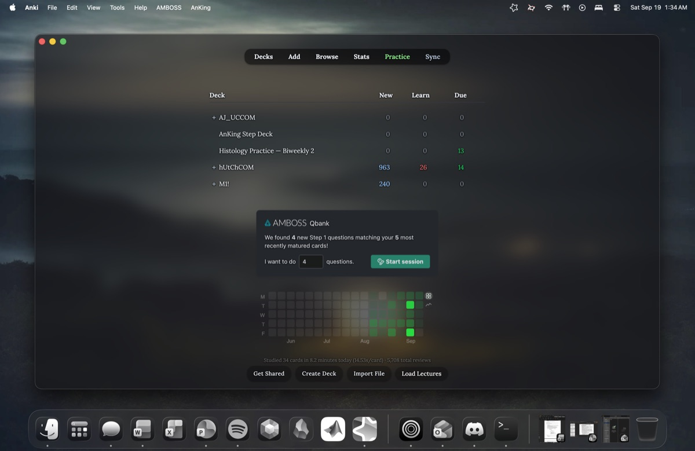
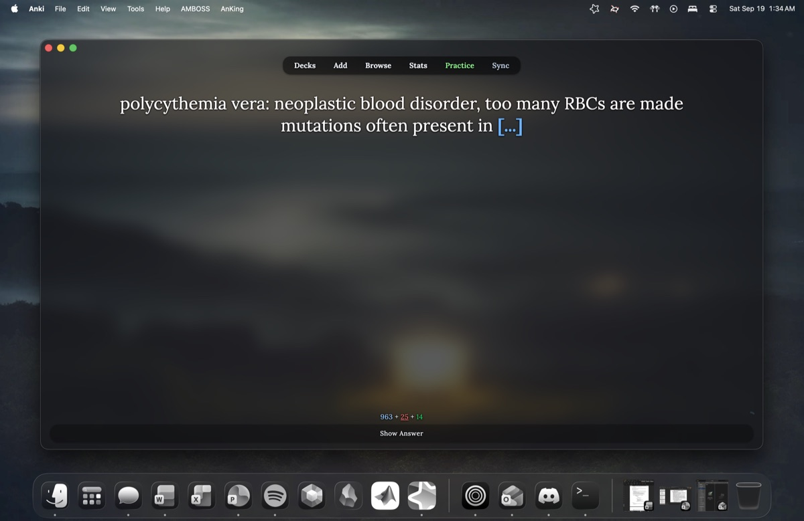
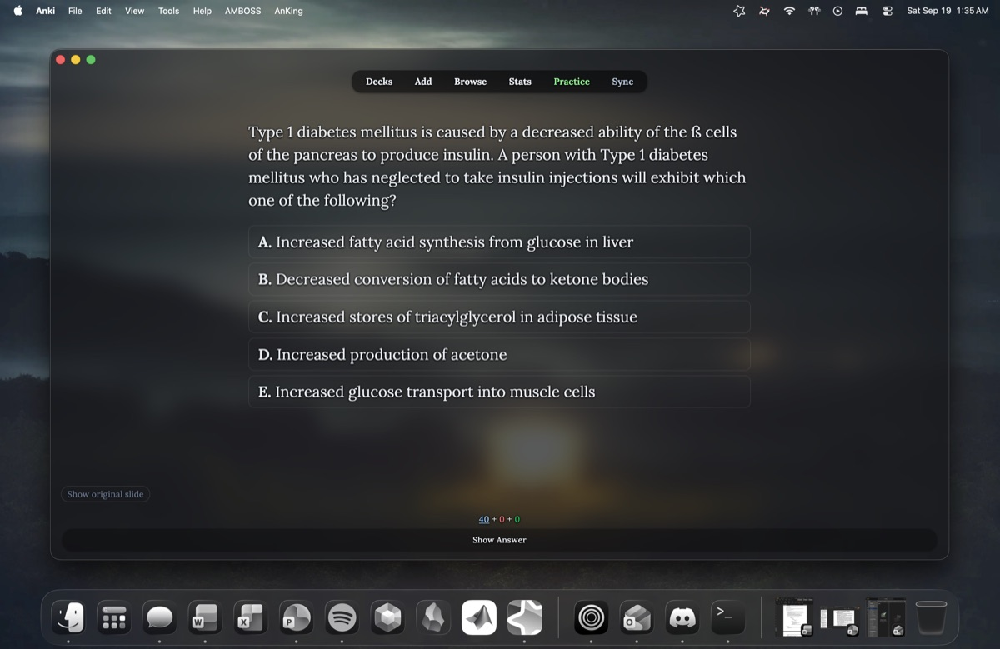
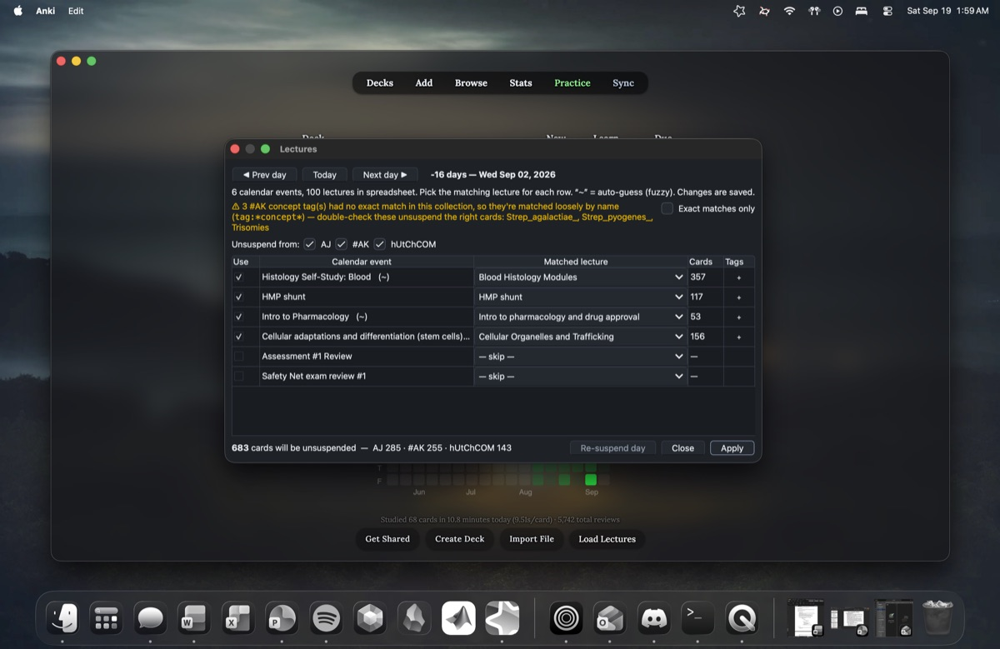

# Janki

A feature rich <a href=https://github.com/ankitects/anki>Anki</a> client designed around you.

  

>[!WARNING]
> Some features within this add-on are still rather experimental. Please use at your own risk!

## Install

Runs as a plugin on top of Anki. No separate app.
Two builds — pick one (each link always downloads the latest release):

- **[⬇ Download `janki.ankiaddon`](https://github.com/cjreplogle/janki/releases/latest/download/janki.ankiaddon)**
  — the full frosted-glass experience. Adds a small, self-healing, reversible
  **patch layer** to Anki that enables the transparency (details below). I use this.
- **[⬇ Download `load-todays-lectures.ankiaddon`](https://github.com/cjreplogle/janki/releases/latest/download/load-todays-lectures.ankiaddon)**
  — a bare-bones version of the add-on that simply has the
  [Load today's lectures](docs/load-todays-lectures.md) import functionality.
  Designed for if you don't care for any of the other features.

1. **Install Anki** (if you haven't yet) from [apps.ankiweb.net](https://apps.ankiweb.net).
2. **Double-click the downloaded `.ankiaddon`** (Anki opens and installs it), or in Anki:
   **Tools → Add-ons → Install from file…** → pick the file.
3. **Restart Anki.** On first launch Janki applies a small one-time patch to Anki
   so the frosted glass can work, then asks you to **quit and reopen once**. Do
   that, and the glass is on. From then on, just open Anki normally.

> [!NOTE]
> **Why the one-time patch + restart?** True transparency needs a setting applied
> before Anki starts drawing — something an add-on alone can't do. Janki modifies
> two of Anki's own files to enable it (backups are kept), and **re-applies
> automatically after any Anki update**, prompting a quick restart when it does.

**From source (devs):** copy the files into
`~/Library/Application Support/Anki2/addons21/janki/`.

### Updating
After the first install, Janki updates itself — no more manual downloads. It
checks this repo's Releases about once a day and, when a newer version is out,
offers a one-click **Update now** (it grabs the matching build, installs it, and
keeps your settings). You can also trigger it anytime with **Tools → Janki: Check
for updates…**, or turn the auto-check off via the `auto_update_check` config.

### Uninstall
Because the glass involves a small patch to Anki's own files, remove it the clean
way: **Tools → Janki: Settings… → General → "Restore stock Anki (remove glass
patch)"**, restart, then delete the add-on from **Tools → Add-ons**. That restores
Anki's original files (repairing its signature) and clears everything Janki added,
so nothing is left behind.

**Windows:** **Tools → Janki: Uninstall…** (also in Settings → General) removes
Janki and everything it added in one click, then closes Anki.

> To change or disable any feature: **Tools → Janki: Settings…**

### Windows (beta)

Janki now runs on Windows too. However, it does not meet my current performance and quality standards. Using it in its current state will be buggy. If you still feel so inclined, you may try it for yourself below.

Download
**[`janki-windows.ankiaddon`](https://github.com/cjreplogle/janki/releases)**

Some features unavailable. New installs start with the **Solid** window (fastest);
pick a glass look in **Settings → General → Window glass**.

## Features

- **Frosted-glass reviewer** — revamps the Anki user interface from the ground up. Minimal, yet designed to seamlessly take advantage of modern hardware features. Includes a rework of card animations, application-wide frosted glass transparency, and much, much more...

  

    
    
  

  

    
  

- **Focus Mode** (**`Tab+F`**) — hides toolbar/answer bar and centers the card.
  Only has the card contents on screen. Also throws in small customizable timer
  which fills over N seconds; when it runs out a red edge-glow flares
  (a "time to move on" nudge). A green flare denotes a card as finished for the day.
- **Lockdown Mode** (`backtick/~+delete`) — locks Janki into fullscreen to keep
  you from getting distracted. Escape by holding space/the entry bind for 10s.
  Tiered into three levels depending on how cooked your attention span is from
  doom-scrolling.
  
  

    <video src="https://github.com/cjreplogle/janki/raw/master/docs/media/scroll-animations.mp4" autoplay loop muted playsinline controls width="560"></video>
  

- **Rephrase** — automatically re-word the same card
  slightly differently while retaining core information (Enable: **`Tab + R`**), so you
  don't simply memorize the card without understanding it. Automatically intersperses
  reworded cards after a single pass, while the original text is easily retrievable. All
  rephrases fall with the same card, so making headway with the adjusted wording has the
  same effect as getting the original card correct.

  **→ [How to Use Card Rephrasing](https://cjre.pl/ogle/janki/rephrase)**
- **Practice questions** — pull multiple-choice questions
  related to the card you're reviewing (**`Tab + Q`**), or load whole question banks into
  Anki as a real, syncable Practice deck. Banks are local `.qb` files; grading is by answer
  choice (correct → suspend, wrong → retry, skip → bury) with a per-bank Score. Runtime is
  100% local.
  
  **→ [Practice system + how to import a document as a question bank](docs/practice-questions.md)**
- **.jank bundles** — one file per content drop: decks (`.apkg`), question banks (`.qb`),
  lecture tag maps (`.json`) and rephrasings (`.rp`) imported together, in the right order,
  without touching your review history. **Settings → General → Import .jank…**, and
  **Build .jank…** to package your own.

  **→ [.jank bundles: importing and building](https://cjre.pl/ogle/janki/jank)**
- **Mobile card theming** *(experimental, off by default)* — AnkiMobile/AnkiDroid can't run
  add-ons, so this can stamp an OLED-dark background, a serif font, and the text-reveal
  animation into your note types (scoped to mobile) so the look rides your normal sync
  to the phone/iPad. It rewrites every note type's templates, so it's opt-in: set
  `"mobile_cards": true` in the add-on config to reveal **Tools → Janki: Mobile cards**
  (Apply / Remove — one-click reversible).
  
  **→ [Mobile cards setup + recommended AnkiMobile settings](docs/mobile-cards.md)**

  

    <video src="https://github.com/cjreplogle/janki/raw/master/docs/media/mobile-cards.mp4" autoplay loop muted playsinline controls width="240"></video>
    <!-- practice mobile clip hidden for now
    <video src="https://github.com/cjreplogle/janki/raw/master/docs/media/mobile-practice.mp4" autoplay loop muted playsinline controls width="240"></video>
    -->
  

- **Load today's lectures** — reads a local `.ics`
  calendar (URL/file) and a local `.txt`/`.xlsx` lecture→tag map, finds your
  classes for the day, and adaptively unsuspends relevant tagged cards
  (AJ/#AK/Hutch decks tested). A calendar is optional — without one you pick
  lectures manually.

  **→ [Load Today's Lectures tutorial](docs/load-todays-lectures.md)**

  

    
  

  *This feature expects your own calendar export and tag map; set their paths on
  the Lectures → Sources tab (or just run **Tools → Load today's lectures** and
  pick a tag map when prompted). Nothing is uploaded — the calendar is read
  locally (a URL source is optional and fetched only if you enter one).*
- **Lecture Card Manager** — click the calendar icon in the toolbar for a week view of
  your classes, built from your calendar and lecture → tag map (matched lectures in blue,
  fuzzy matches edged amber). Click a class to manage that lecture's cards in one place:
  **Study active cards** or **Study all cards** (a temporary filtered deck — reviews count
  normally), **Suspend / Unsuspend cards for this lecture**, and see which tags it pulls
  in. **Study Progress** ranks the lectures you've already had by how under-studied
  they are, so you know what to catch up on. Everything is read locally.
- **Caption Mode** — Trying to multitask but still see your anki cards? Press **`Tab + \`**
  to change the Anki notecard view to be in "caption" form. **`Tab+Arrow Keys`**
  adjusts their screen position. Remains visible in this view even when other
  things are in fullscreen. (Note: also integrated to work & adjust with remote buttons)

  

    <video src="https://github.com/cjreplogle/janki/raw/master/docs/media/caption-mode.mp4" autoplay loop muted playsinline controls width="560"></video>
  

- **Global hotkeys & remote** — hold **Tab** as a modifier or use your
  controller to drive the reviewer even when Anki is not focused.
  (i.e. **`Tab+Z`** → again, overrides being unfocused). **`Cmd+Opt+A`** also will globally
  focus the Anki window regardless of whatever else you are doing.
  Every shortcut (including the Tab chord key itself) can be changed in
  **Settings → Hotkeys**.
- **Pomodoro** — review-time work intervals, an in-window break screen
  (hold **Space** to skip), and a calm "break due" blue edge tint.
  Toggle the whole system on/off in settings. 
- **Tray menu** — keeps Anki open in the background and allows you to navigate a
  miniaturized menu with other things focused.
- **Quick Zoom** — for whatever god forsaken reason Anki does not have **`Cmd+`**
  or **`Cmd-`** hotkeys to zoom card contents so that exists now...

## Changelog

Grouped by version; open one to see its releases. Every release is also on [GitHub Releases](https://github.com/cjreplogle/janki/releases).

<b>2.10</b> · 2026-10-08 · 1 release

**2.10.0** · 2026-10-08

- **AnKing loads much faster**: lecture tag searches are matched against an in-memory tag index instead of Anki's search, so lectures with hundreds of AnKing tags load in a fraction of a second.
- **Weak areas no longer hangs with AnKing on** (tags with parentheses are matched individually).
- **Several spreadsheet tag maps at once**, including the older AnKing sheet layout (Settings → Lectures → More maps).
- **Windows**: one-click uninstall (Tools → Janki: Uninstall…), and new installs start with the Solid window.
- Top-right settings button on by default for new installs.

<b>2.9</b> · 2026-10-07 – 2026-10-08 · 4 releases

**2.9.3** · 2026-10-08

- **AnKing loads much faster**: lecture tag searches are now matched against an in-memory tag index instead of running through Anki's search one tag at a time. Lectures with hundreds of AnKing tags load in a fraction of a second instead of lagging Anki.

**2.9.2** · 2026-10-07

- **Weak areas no longer hangs with AnKing on**: AnKing tags with parentheses in their names (e.g. `T-score_(DEXA)`) made Weak areas run one enormous Anki search per lecture, freezing or crashing Anki. Those tags are now matched individually, like every other tag.

**2.9.1** · 2026-10-07

- **Several spreadsheet tag maps at once**: you can now use more than one .xlsx tag map. Add extra spreadsheets under Settings → Lectures → **More maps** (or drop one on the window once a base map is set); each lecture gets the tags from every map. Before, adding a second spreadsheet replaced the first.

**2.9.0** · 2026-10-07

- **Windows: Solid window by default**: new Windows installs start with the **Solid** window glass (a plain dark window, fastest). Existing setups keep their current choice; change it anytime in Settings → General → Window glass.

<b>2.8</b> · 2026-10-07 · 15 releases

**2.8.14** · 2026-10-07

- **Settings button shown by default**: new installs now show the top-right settings button. Existing setups keep their current choice (Settings → Appearance → Window).

**2.8.13** · 2026-10-07

- **Older AnKing tag sheets work in the tag mapper**: spreadsheets laid out as side-by-side lecture / **Anking** column pairs (one sheet per module, no decks column) now load lecture by lecture, the same as the current sheet.

**2.8.12** · 2026-10-07

- **Much faster AnKing searches**: lecture searches using AnKing as a source no longer list every sub-tag of a concept (one tag already covers its children). Broad concepts went from up to ~20,000 search terms to ~1,300, so loading lectures from AnKing no longer lags Anki.

**2.8.11** · 2026-10-07

- **Windows: one-click uninstall**: **Tools → Janki: Uninstall…** (or Settings → General → Uninstall Janki…) removes Janki and everything it added, then closes Anki.
- Deleting Janki from Tools → Add-ons now also removes its start-up hook from Anki's Python folder (it used to stay behind and keep running). A hook left over from an earlier delete removes itself at the next start.

**2.8.10** · 2026-10-07

- **.docx question banks load straight into a deck**: importing a .docx now always creates its Practice deck, including from Settings → Practice and on a profile without a Practice deck yet (before, it could import without making a deck). Drag a .docx onto the Anki window and press **Create & import**

**2.8.9** · 2026-10-07

- **More .docx question banks**: the .docx importer now also reads banks that use Word's automatic numbering (question numbers and A–E choice letters added by Word) with the answers in a key at the end ("Answer: C. …" followed by "Explanation: …"). Answers are matched to questions in order and checked against the key's choice text

**2.8.8** · 2026-10-07

- **Pomodoro**: holding Space to skip a break now works even if macOS hasn't given Anki keyboard-monitoring permission
- **Practice cards**: the rephrase button no longer overlaps "Show original slide" (desktop and phones)

**2.8.7** · 2026-10-07

- **Older Anki versions**: if your Anki is too old for Janki's glass, Janki now says so (once, at launch) and names your Anki version. **Settings → General** shows the same message instead of a greyed-out button with no explanation. Update Anki from apps.ankiweb.net, then relaunch it twice.

**2.8.6** · 2026-10-07

- **Idle CPU fixed**: after you'd opened Stats once, Anki could keep a whole CPU core busy while sitting idle for the rest of the session (with 120 Hz on). Stats now releases itself when you leave it, so idle CPU stays low (about 100 % → 4 % in testing). Each Stats open loads fresh (about 0.4 s)

**2.8.5** · 2026-10-07

**Stats**
- Fixed Stats sometimes opening as an empty pane, with Anki using a full CPU core, until restart. Hover preloading (added in 2.8.0) caused it, so it's been removed. Stats again loads on your first click each session, then opens instantly

**Window**
- One click on the Dock icon now reopens the window after closing it with the red X (it took two)

**Tray**
- Classes no longer stay grey when the tray is opened right after launch; they fill in with their course colours

**2.8.4** · 2026-10-07

**Closing to the menu bar**
- The red X now reliably keeps the window closed. Before, it could reappear as an empty glass frame, either right after launch or a moment after closing
- The Dock icon and ⌘-Tab still bring it back

**Stats**
- Fixed Stats sometimes opening empty after switching pages quickly (it stayed empty until Anki was restarted). Janki now checks each open and rebuilds the view if it comes up blank
- Fixed Stats opening empty when clicked while its background load was still running

**Also**
- After an update that refreshes the macOS glass patch, the rebuild runs in the background instead of freezing the window for a few seconds

**2.8.3** · 2026-10-07

- **Closing to the menu bar sticks**: pressing the red X no longer brings the window straight back (blank until clicked). The Dock icon and ⌘-Tab still reopen it
- **No freeze after updating**: when an update refreshes the glass patch, it's rebuilt in the background instead of freezing the window for a few seconds after launch

**2.8.2** · 2026-10-07

**Glass on more Macs**
- Glass now works when Anki's files are installed outside Anki.app (for example by Anki's launcher)
- Quitting at the profile chooser, or starting Anki with add-ons off, no longer switches glass off on the next launch
- The one-time glass setup download no longer fails on Macs missing the system certificates
- If macOS "Reduce transparency" is on, Janki says so (glass draws solid while it's on)

**Settings → General**
- The glass patch button is always there on macOS. When glass can't be applied to your Anki, it's greyed out with the reason
- Every click now reports what happened (restart prompt, or exactly why it didn't apply)
- "Restore stock Anki" after an Anki update now restores the current version's files

**Also**
- Janki says why when glass is off because this Anki is too old

**2.8.1** · 2026-10-07

**Tray & Calendar**
- The tray no longer says "No classes" while the calendar is still loading: it shows "Loading classes…" and fills in when your classes arrive
- A tray prepared before midnight (Anki left running overnight) is rebuilt when opened, so "Today" is really today
- Classes that arrive after "Loading…" fade in, in their course colours, instead of popping in (Calendar: a day at a time)

**2.8.0** · 2026-10-07

**Stats opens ready**
- Pointing at **Stats** in the toolbar starts loading it in the background, so the click shows it straight away (the first panel appears in about 0.15 s)
- Not while studying, and no cursor flicker

**Calendar & lectures**
- With AnKing on, today's lectures no longer auto-load at launch (it can take minutes). Turn it back on with **Settings → Lectures → Behavior → Auto-load even with AnKing on (slow)**
- Calendar: opens at the top, so short windows keep their space under the toolbar
- Notices shown at launch now use Janki's glass style

**Faster first launch of the day**
- Nothing Janki reads from disk runs before the first deck list anymore (calendar prewarm, data sync)

**macOS**
- Opening **Practice** no longer flickers: the page is rewritten in place instead of reloaded

<b>2.7</b> · 2026-10-06 – 2026-10-07 · 4 releases

**2.7.3** · 2026-10-07

**Pomodoro**
- Going back to the menu while a break is due (blue tint showing) now cancels that break and restarts the work timer, instead of the tint coming back on the menu and the break taking over your next card

**Typewriter**
- Plays on every card show, including fast flips and relearning cards shown again
- A reveal that stalls now finishes instead of staying half-typed

**Faster**
- Practice: the deck list and question-bank progress are much quicker with many banks

**Also**
- Settings: the calendar's Refresh button no longer flashes as its own little window when Settings opens

Windows users: see **2.7.3w** for the Windows rendering rewrite.

**2.7.2** · 2026-10-07

**Fix: calendar and lecture sync**
- A passphrase set in Settings → Lectures → Sync was treated as missing, so nothing synced. It now works with the passphrase you already set; no need to enter it again. Update every computer, then sync each one.

**2.7.1** · 2026-10-07

**Sync your calendar and lecture setup between computers**
- Your calendar URL and settings, calendar colours and class counts, the lecture spreadsheet, source decks, exclusions and aliases now travel with your normal AnkiWeb sync
- Everything is encrypted with a passphrase before it leaves your computer: AnkiWeb can't read the calendar URL, the spreadsheet or even the file names
- Set it up in **Settings → Lectures → Sync**: use the same passphrase on each computer (Mac or Windows). Nothing syncs until a passphrase is set
- A computer that receives the calendar URL downloads the calendar itself; the spreadsheet is saved into Janki's folder if its original location doesn't exist there
- If two computers use different passphrases, Janki says so once, after a sync

**Lectures settings, reorganized**
- **Sources**: the tag map, plus the sources the Calendar uses. Each source's decks fold away behind a **+** button
- **Calendar**: the calendar file/URL, Refresh now, today's lecture window and the timezone
- **Sync**: the new sync settings, including your current passphrase (hidden until you press Show)

**Also**
- Deck list: starts closer under the toolbar, matching the gap above it
- Settings: the window resizes properly when the Sources list loads or a source is expanded

**2.7.0** · 2026-10-06

**Smoother on ProMotion (120 Hz) Macs**
- Lifts the 60 fps limit on animations and scrolling (applies after two launches; create an empty `~/.janki_60fps` file to go back to 60)
- Idle CPU stays low: the controller polling no longer redraws the page constantly, and a hidden Calendar spinner no longer animates
- The text scroll and the mobile card reveal now run by time, so they keep the same speed at any frame rate

**Better practice-question matching**
- Questions filed under a subdeck (by the .docx subdeck mapping or a tag map) now count as a direct deck match for cards in that subdeck
- A question whose lecture title agrees with the card's deck/tag name ranks higher within its tier
- Deck tags guessed from question text rank below guessed concept tags
- Questions carrying a huge, meaningless tag list (from an over-broad lecture-map entry) no longer match every card, and lecture-map tagging no longer creates them or overwrites existing tags
- Matching is much faster during review

**.jank bundler**
- Expand a question bank or tag map to pick individual lectures; a bank selection ships as its own "(selection)" bank so it never replaces someone's full copy
- **Trim banks and tag maps to the ticked decks**: ticks only the lectures your chosen decks actually use
- Only tag maps that are in use (Settings → Lectures → Tag map) are offered; long names are no longer cut off

**Also**
- Text scroll: list bullets now appear with their line instead of all at once
- Deck list: rows fade out at the bottom above the button bar
- **Launch**: the window fades in once the deck list is ready (no more text popping in)
- Tooltips such as "Collection sync complete" fade in and out
- macOS: quitting soon after launching no longer turns glass off on the next launch
- Settings: the tab row always clears the window's close button, even on narrow windows or with larger system fonts
- Calendar: thinner Study Progress outline

<b>2.6</b> · 2026-10-06 · 5 releases

**2.6.7** · 2026-10-06

- **macOS: double-click to import** — on first launch Janki registers `.jank`, `.qb` and `.rp` files to open in Anki (only file types that have no default app yet, so your own choice is kept). Double-clicking one then imports it.

**2.6.6** · 2026-10-06

**Smoother reviews**
- Fixed the hang where Z/X/C/V seemed to do nothing for a moment: the tray menu no longer re-reads your decks after every answer, Practice bank checks wait until you leave the reviewer, and the answer side's extras run after the answer appears
- Text scroll no longer stutters early in a session: the Practice "borrowed tags" index builds in the background shortly after launch, without holding the collection
- List bullets no longer appear ahead of the typing text-scroll
- Anki no longer steals focus from other apps right after login/sync

**Practice questions**
- Review picks matched tags/decks first by a wide margin, then tags inferred from text, then near-miss tags, then word similarity — word similarity only orders questions within a tier
- `.docx` import: optional **Map to subdecks of** — questions are filed under the matching subdeck (by header name, else by content) and link to that subdeck's cards
- `.docx` import: optional **tag map** CSV (Q, deck, tag, Stem) — auto-detected next to the .docx or chosen with **Choose tag map…**
- `.docx` and `.jank` imports run in the background with a glass progress panel; Anki stays usable
- Renaming a deck inside Practice keeps it in Practice

**Also**
- Export window: new **Tags (.txt)** format — every tag in a deck + subdecks (or selected notes), with an optional indented subdeck tree
- Rephrase: rewords where the on-device model padded the card with invented/repeated lines are discarded

**2.6.5** · 2026-10-06

**Review by arrow keys**
- **↑** on a card goes up to the toolbar (starting on Decks); **↓** goes down to the bottom bar
- In the bottom bar: Show Answer first, then **Good** once the answer shows; **←/→** pick Again / Hard / Good / Easy, **Enter/Space** press, **↑/Esc** back to the card
- The arrows go straight to navigation (they no longer scroll the card first); practice questions keep their own arrow keys

- **Enter/Space** on an arrow-key-selected toolbar item opens it during review (instead of flipping/answering the card)

**Also**
- **Background sync**: the automatic sync when Anki opens no longer shows a Syncing… window; on quit the window hides at once while the sync and backup finish (`sync_in_background`, on by default)
- Rephrase prompt and objectives tag-map dialogs: checkboxes visible again
- Deck list: the settings gear no longer stays on a deck after you collapse it

**2.6.4** · 2026-10-06

**Keyboard navigation**
- Toolbar arrow keys: one highlight only (a clicked item no longer keeps its own ring beside the selection)
- ↑ from the Calendar starts on the Calendar item (was Decks)
- The toolbar highlight clears while you arrow through Calendar lectures or decks, and comes back when you switch to another app and return; ←/→ always start a selection on a focused toolbar

**Tour**
- Focus → Reviewing stays on the open sample card instead of reloading it

**Also**
- The Practice button on cards sits off the bottom edge so its highlight isn't cut off
- Ctrl+Z and menu shortcuts work while the menu bar is hidden; Z / X / C / V rate reliably once the answer is showing; Text shadows setting (Appearance → Text)

**2.6.2** · 2026-10-06

**Practice question import (.pptx)**
- **Highlight-reveal banks**: where the right answer is revealed by an animated box over a screenshot, Janki reads the box to mark the correct choice, and attaches the next slide as the explanation
- **Exam-software screenshots** ("Item 2 of 48" screens, QID cards): toolbar and sidebar clutter stripped, numbered choices understood, "The correct answer is X" keys read
- Questions split across two screenshots on one slide (stem + choices) now import as one question
- Radio-button choices ("○ A)") read correctly
- EOB-style bank: ~185 of ~230 questions now import complete (was ~40)

**.jank builder**
- New **Decks** group: tick decks (subdecks included) to bundle them as .apkg, media included, review history optional; shown as an expandable tree

**Look & feel**
- Keyboard focus rings follow the button's rounding (no box inside the ring) on the toolbar and bottom bar
- Tour: rounded spotlight with its full ring; the Calendar step opens the Calendar itself
- Deck list: fixed width, stable scrollbar gutter, bigger +/− targets that no longer get swallowed by the name's hover

**Also** — Z / X / C / V always rate (replay own voice moved to Alt+V), tray sound levels, day seeking and class details in the tray, calendar fixes, lower memory use

<b>2.5</b> · 2026-10-05 · 1 release

**2.5** · 2026-10-05

**Calendar**
- **Study Progress** (was Identify Weak Areas): **Biweekly** (since last Monday) and **End of block**, grouped by your biweekly assessments from the calendar (Biweekly I, II, …), each lecture with a mini 14-day review line; suspended cards no longer count as "not started"
- Class pages open instantly (counts fill in, with a small spinner while refreshing); Open in LMS for any event with a link; − to unassign a lecture; arrow-key navigation
- Dress codes from class notes, star for mandatory, calendar URLs downloaded once a day (+ Refresh now)
- Sources' decks found automatically; switch whole sources off (Settings → Lectures → Calendar); Practice match Lenient / Strict

**Tray**
- Decks | Practice | Today as a segmented switch; Today is a mini day view (8am–1pm) with course colours
- Opens instantly (built in the background, no card data needed), capped at half the screen
- Right-click the speaker for Navigation / Reviews sound levels; closes on any outside click

**Also**
- Card tags pinned above the answer buttons, capped (Settings → Appearance → Text)
- Sounds settings moved under Appearance; hot corner under Focus
- Safer lecture defaults for new installs (only Hutch loads); warning when AnKing auto-load is on
- Many fixes: quit hangs, focus stealing, temporary decks hidden, sync no longer kicks you out of the calendar

<b>2.4</b> · 2026-10-05 · 1 release

**2.4** · 2026-10-05

**Calendar**
- **Identify Weak Areas** (bottom bar on the Calendar): past lectures ranked by unstarted cards, recall, due cards and leeches — "Past 2 weeks" (since last Monday) or "End of block" (8 weeks), with a progress bar; click a lecture for its page
- **Practice** button on class pages: related practice questions in a temporary deck (Lenient / Strict setting)
- Opt individual tags out of a lecture (− on a tag chip), tag counts on classes, **Open in LMS**
- Sources' decks found automatically (e.g. Hutch → CRanki); switch whole sources off (Settings → Lectures → Calendar)
- Dress codes from class notes, star for mandatory classes, side-by-side overlapping classes, now-line, day-by-day arrow keys, trackpad swipe, grid fills the window

**Faster, lighter**
- Calendar opens instantly (primed at launch); class pages and weak areas no longer queue behind background work
- Lecture searches cached; AnKing's big tag map handled far more gently
- Fixed the "Expression tree is too large" error on big lectures, hangs on quit, focus being pulled while in other apps

**Also**
- WorkMode-style hot corner (Settings → Focus → Hot corner): a preview slides in; click to bring Anki back
- Card tags pinned above the answer buttons, capped (Settings → Appearance → Text)
- Space no longer swallowed in editors during a Pomodoro break
- Safer defaults: new installs only load Hutch lectures; warning when AnKing auto-load is on

<b>2.3</b> · 2026-10-05 · 1 release

**2.3** · 2026-10-05

**Calendar (new)**
- Calendar page from your lecture calendar: Day / 3-day / Week views with smooth slides, remembers your view
- Click a class for its page: pick the matching lecture, choose sources, study unsuspended or all cards (suspended ones are put back afterwards), unsuspend, view tags
- Course colours, a star on mandatory classes, side-by-side overlapping classes, a red "now" line
- Dress codes from class notes shown at the top of the day; assignments only on their due date; repeating events supported
- Navigate with ←/→ (day by day), ↓/↑, Enter, or a two-finger trackpad swipe
- Tray: switch between Decks and today's classes

**Also new**
- Hot corner (pick the corner in Settings)
- Update button on the main screen
- Right-click a deck to unsuspend or create a subdeck
- Status while a .pptx is importing
- Lecture wizard: switches, quick buttons to change the calendar / spreadsheet file, fades in

**Fixes**
- Pomodoro no longer steals focus or flares over other apps
- Large lectures no longer hit a database error when counting/studying
- Faster: calendar reads and lecture matching happen in the background
- Checkbox drawing on older Macs, tour boxes line up with the card, deck-name hover loop
- Sounds on Windows/Parallels

<b>2.2</b> · 2026-09-30 · 1 release

**2.2** · 2026-09-30

**Getting started**
- Guided "Welcome to Janki" setup and an interactive in-app tour (practice questions, rephrasings, Focus/Caption, lectures, keyboard shortcuts)
- One restart on install, with plain explanations for permissions

**Keyboard & controller**
- Navigate decks, banks, the toolbar, Settings and practice answers with the arrow keys / a controller (Enter/Space open, ↑ into the toolbar)
- New shortcuts: ⌘D Decks · ⌘G Practice · ⌘B back · ⌘O last deck · ⌘L lectures · ⌘S Settings (all rebindable)
- Controller +/− zoom the card; Contanki no longer double-reads the pad in menus

**Sounds (optional, off by default)**
- Soft UI sounds for navigation and reviewing, 4 sound sets + a custom folder, per-sound levels (drag) and on/off (right-click)

**Smoother & faster**
- Continuous transitions between Decks, Practice and Stats; steady deck columns; balanced deck overview
- Faster first card; lecture wizard lag fixed

**Also**
- Import File handles Janki files; drop .docx/.xlsx anywhere
- Dark mode by default, Disable animations switch, glass/photo toggles
- Lockdown: tray usable, quitting waits out a countdown
- Many fixes (fullscreen restore, flares over Settings, practice arrow keys, and more)

<b>2.1</b> · 2026-09-29 · 1 release

**2.1.6** · 2026-09-29

- **One restart to install**: Janki sets up its glass right away and restarts Anki itself if needed (with safeguards against restart loops).
- **Z / X / C / V** rate cards Again / Hard / Good / Easy, like 1–4 (Settings → Hotkeys)
- Close-to-tray is off by default
- Anthropic Serif font option removed (if selected, you're moved to Lora)
- Includes all 2.0 features. Janki now also runs on Windows — see the 2.1.6w release.

<b>2.0</b> · 2026-09-29 · 1 release

**2.0.0** · 2026-09-29

**New: adjustable hotkeys.** Settings → Hotkeys lists every Janki shortcut (including the Tab chord key) in collapsible groups. Click one, press a new key; duplicates are flagged and everything can be restored to defaults.

**Motion and polish**
- Deck names slide and grow a soft pill on hover; toolbar items and buttons fade, lift and press
- Subdecks drop down when you click + and fold up on −
- The deck list's width and its New / Learn / Due columns glide instead of jumping as subdecks open and close; headings are centred over their numbers
- A little more space between whole decks, and after a subdeck group
- The first card fades in when you start studying
- Study Now is larger and a paler blue
- The deck list's column headers (Deck / New / Learn / Due, and Bank / To-Do / Review / Completion) stay pinned at the top while you scroll
- The "Congratulations! You have finished this deck" page uses the Janki font
- Honours macOS Reduce motion; turns itself off if the Anki Redesign add-on is enabled (Settings → Appearance → Text → Hover animations)

**Practice questions**
- A wrong answer now buries the card until your next session instead of grading it Hard
- "Score" is now **Completion**: the share of a bank's answerable questions you've cleared
- To-Do / Review / Completion are centred over their numbers

**Fixes**
- Slide OCR no longer turns "T cells" into "I cells" (I-cell disease is left alone)
- Card-timer flares no longer steal focus from the fullscreen reviewer
- Loading a big lecture day no longer freezes Anki

<b>1.9</b> · 2026-09-25 – 2026-09-27 · 5 releases

**1.9.4** · 2026-09-27

- Rephrase: reworded backs keep the answer divider, so the text reveal types only the back
- Rephrase: reworded cards that reorder lines are styled by content instead of misaligned line-by-line
- Rephrase: card text like "renal function" is no longer mistaken for code and dropped
- Overlays sliding over Anki (e.g. hot-corner peeks) no longer reveal the hidden bars in full screen

**1.9.3** · 2026-09-26

- Settings, Load today's lectures and the import/rephrase dialogs now always stay in front of the main Janki window
- All stored rewords: new deck/subdeck dropdown filter; fixed the header overlapping the titlebar
- Clear rephrasings: "+" deck tree to clear only specific subdecks

**1.9.2** · 2026-09-26

Statistics polish.

- **Reviews graph is now directly below Today** (where Future Due was).
- **Blue graphs.** The Reviews graph is a single blue gradient instead of green/red/orange/purple, and the orange "learning" color in the other graphs is recolored blue.
- **Rolling-average line.** A "Rolling avg" checkbox sits in the Reviews graph's range row (1 month / 3 months / 1 year). Turn it on for a translucent dotted-blue rolling-average line over the bars. It stays put when you change the range.

Relaunch Anki, then open Statistics.

**1.9.1** · 2026-09-26

Follow-up to 1.9, focused on matching untagged cards and reviewer polish.

**Practice question matching**
- **Untagged cards now match well.** A card with no tags (e.g. cobo/KCOM decks) borrows concept and lecture tags from your most similar tagged cards, then matches questions through those. In testing this landed on the right lecture far more often than the old text fallback.
- **Different cards get different questions.** Matches are now ordered by the card's own distinctive words, so consecutive cards in one deck no longer all pull the same first question.
- Everything runs locally; a similar-card index builds itself in the background a few seconds after launch.

**Reviewer**
- **New on-card "Practice" button** in the bottom-right corner (same look as the Original/Reworded toggle) — same as Tab+Q. It reads "Back to card" while on a practice question. It's revealed on hover and tucks into the card-timer ring's spot, fading the ring while shown.
- Original text shows on a card's first view each session; rephrasings show on later views the same day.
- Reword and "Show original slide" buttons are a bit larger; the next-rephrasing arrow stays hidden until you hover the corner.
- Fixes: buttons no longer jump in Focus Mode; practice questions keep side padding in a narrow window; the slide photo no longer lingers after Ctrl+Z; bullet/number lists now reveal with the text-scroll animation.

**Other**
- Statistics opens on the whole collection by default (you can still pick a deck).

Relaunch Anki after updating; your banks re-tag once (a couple of seconds).

**1.9** · 2026-09-25

A big one: practice questions now find related cards much better with no AI, sharing .jank bundles got smarter, and Load today's lectures reads far more of your spreadsheet.

**Practice questions**
- **Better automatic matching (no AI).** Each question is matched to the lecture it fits best in your own decks — Hutch, AJ, other school decks it detects automatically, and decks organised by deck name rather than tags. Runs by itself on every import.
- **Tab+Q uses what you've been studying.** It also pulls questions for the cards you just reviewed, so a card without its own match still gets relevant questions (Settings → Practice → Intersperse).
- **Back out of a question** with Ctrl+Z or Tab+Q again — you return to your card and the question goes back into the pool.
- **Cleaner imports from slides.** Sections now come from the deck's real title slides, so author comments like "Might be out of scope" no longer become sections. Re-import a .pptx to get the new sections (your card progress is kept).
- **AI tag-matching prompt:** pick specific subdecks, see a token/time estimate, and drag the AI's .json reply straight onto your banks. Prompts never include hidden data, images or occlusion masks.
- **AMBOSS Qbank tile** now shows under Practice instead of on the Decks screen (toggle in Practice → Format).

**Sharing (.jank / .rp)**
- Question banks in a .jank go straight into your Practice deck.
- Rephrasings now reach friends' copies of the same decks (matched by note GUID, not collection-specific ids).
- Rephrasings are grouped into **sets** (per imported file, pasted reply, or on-device), and Build .jank lets you pick which sets to include.
- Choose whether shared banks include their tag matches.
- Drag .jank/.qb/.rp files anywhere onto the main window; drag .pptx/.docx onto the Practice view to build a bank.

**Load today's lectures**
- **Fixed a spreadsheet-reading bug** that silently skipped many lectures (one real sheet went from 100 to 321 lectures found). More of your calendar now matches automatically — glance over the checked rows the first few days.
- The lecture dropdown is ordered by how well each lecture matches the calendar event.
- Switching days no longer stalls.

**Look & feel**
- Optional round **settings button** in the top-right of the main window (Appearance → Window).
- Mobile practice cards: start at the top, no letter-by-letter typing, steady answer sizes, smoother slide mode.
- Bigger tray settings gear; the tray's Settings button opens reliably.
- Deleted question banks are kept for 7 days instead of being wiped on the next launch.

After updating, relaunch Anki. The first launch re-tags your banks once (a couple of seconds), then sync to bring card changes to your phone.

<b>1.8</b> · 2026-09-25 · 4 releases

**1.8.3** · 2026-09-25

Mobile polish for practice questions (AnkiMobile / AnkiDroid).

- **Opens at the top** — practice questions no longer open centred or scrolled down, and short questions can't be scrolled into empty space.
- **Show original slide** — the button stays pinned just above the bottom of the screen.
- **Slide mode** — the question slide keeps its size and position when you reveal; the answer slide appears directly below and fades in after it. Quick fades between cards and when closing slide mode.
- **Animations like desktop** — no letter-by-letter typing on practice cards: the question fades in, the choices fade in one by one, and nothing replays on the answer side.
- **Consistent answer size** — choices no longer resize when the explanation appears.
- Mobile card styling now refreshes itself on launch after an update.

After updating: relaunch Anki, then sync so the changes reach your phone (the first sync sends your note types once).

**1.8.2** · 2026-09-25

**Open Janki files from Finder**
Double-click a **.jank**, **.qb** or **.rp** file (or drop it on Anki's Dock icon) and Janki imports it: bundles run the .jank import, question banks install, rephrasings merge. This works even when Anki is closed; the file is imported once your profile opens.

**One-time setup per file type:** right-click the file → Open With → Other… → set *Enable* to **All Applications** → pick **Anki**. Then Get Info → Open with → **Change All…**

**1.8.1** · 2026-09-25

**Practice question importer**
- **Two-column textbook pages** are now read column by column, so board-style questions no longer lose their shared case or pick up text from the other column.
- **Shared cases** ("Questions 11 through 13 are based on the following case…") are attached to every question in their range, including when the lead-in wraps across lines, and no longer leak onto unrelated questions later in the deck.
- **Matching sets** (several stems sharing one A–E list) import as separate questions with the shared choices.
- **Questions split across two screenshots** are rejoined, and their slide shows both halves.
- **Wrong answer keys** from other chapters that reuse the same question number are rejected; those questions import as ⚠ incomplete instead.
- "IN" misread for **1N** in DNA-content questions is corrected.

Re-import a bank's .pptx to pick up these fixes. Question IDs are positional, so delete that bank's Practice deck first for a clean rebuild.

**Other**
- Deleting a bank's cards in the Practice tab now also removes the bank from Installed Banks (Undo restores it).
- ".jank file" in Settings → General links to the [.jank guide](https://cjre.pl/ogle/janki/jank).

**1.8** · 2026-09-25

**.jank bundles — one file per content drop**
- **Import .jank** (Settings → General, or drag it onto the tab): brings in decks (.apkg), question banks (.qb), lecture tag maps (.json) and rephrasings (.rp) in one go, in the right order. Your review history and scheduling are never touched; a new drop simply updates banks and maps.
- **Build .jank**: tick installed question banks, lecture tag maps and your rephrasings — or add files from disk — name the drop, and export one file to share. Guide: `docs/jank.md`.

**Settings**
- **Appearance** is now split into **Window** (glass, Photo Background, OLED, always-on-top, tray), **Text** (interface & mobile card font, text animation, uniform text size, AMBOSS) and **Mobile** (mobile card theming).
- **Uniform text size across card types**: every note type's text at the same base size (desktop and phones), keeping emphasis you typed into cards.
- **Green flare intensity** slider next to the red one.
- Controller input while unfocused moved to Focus → Caption.

<b>1.7</b> · 2026-09-24 – 2026-09-25 · 7 releases

**1.7.6** · 2026-09-25

**Fixes**
- **Stats ↔ Decks / Practice navigation:** leaving Stats now takes a single click (including Practice → Stats → Decks), with a smooth fade instead of flashing the old deck list or Practice view, and no window flicker afterwards.
- **Mobile "Show original slide":** the slide now sits on true black, the card text no longer flickers through behind it, and moving between cards in slide mode no longer blinks.

Relaunch Janki (it updates the Practice note type automatically), then sync and reopen AnkiMobile.

**1.7.5** · 2026-09-25

**Rephrase**
- **Rewords keep the card's formatting:** headings, larger key lines/phrases, nested & numbered lists, spacing, bold, cloze hints like *[increase/decrease]*, and the note type's own size/centering.
- **Drag a `.rp` file** onto Settings → Rephrase to import it.
- **View all rewords** opens instantly, even with thousands stored.
- **Safer storage:** your rephrasings file is never overwritten after a failed read, and every save keeps a backup (plus a timestamped copy when a lot is removed).

**Mobile**
- Rewords on AnkiMobile look like desktop (same formatting, Janki font, cloze colors, images) and show the right side: revealing the answer keeps the rephrasing you chose, with no flash of the original.
- The Original/Reworded button stays pinned at the bottom, never covers text, shows its label instantly, and no longer triggers the tap flare.
- Cards with hard-coded black text (e.g. pasted KCOM cards) are readable; on cloze answers only the revealed answers type in.
- **Enable / update on mobile** now also themes note types added since you applied mobile styling. Press it, then sync.

**Desktop**
- No black-text flash on dark glass; Anki's progress window stays centered.

**1.7.4** · 2026-09-25

**Statistics, inside Janki**
- **Stats opens in the main window** instead of a separate window — glassy, in your Interface font, with the graphs revealing one by one and a soft fade as cards scroll off the top.
- **Deck picker** at the top: a frosted popup with *Whole collection* and your top-level decks; press **+** to unfold subdecks.
- **Fast:** the stats page preloads after launch, refreshes quietly in the background when you return to the deck list, and switching decks just swaps the data (no reload).
- Leave with **Esc**, **Stats** again, or any toolbar button (including Practice). **Shift+Stats** still opens Anki's own statistics window.
- Works alongside the AMBOSS side panel.

**Tray**
- Mode buttons now recolor live when you toggle Caption / Focus / Lockdown / Rephrase with a keybind while the tray is open.

**1.7.3** · 2026-09-24

**Rephrase**
- **Much smaller prompts.** New *Minimize duplicated text* option (on by default): each cloze note is sent once for all its cards, and basic cards send only their back. Janki rebuilds every card's front and back on import — prompts are ~5–6× smaller, so models finish much faster.
- The prompt now tells the model to write the `.rp` file directly (no scripts or drafts).
- **Subdeck picker:** decks with subdecks get a **+** in the prompt wizard to pick subdecks individually.
- **Rewords keep formatting:** bold lines, bold terms and bullet lists from the original card carry over to the reworded view (works on existing rephrasings too).
- **Mobile:** each card now gets its own rephrasings (cloze siblings no longer borrow each other's wording) — press *Enable / update on mobile* once, then sync. New *Toggle Rephrase Button for Original Cards* setting hides the button on cards with no rephrasing.

**Polish**
- Settings no longer leaves empty space under text-heavy tabs.
- Tray shortcut hints sit in the top-right corner, smaller on Caption/Focus/Lockdown.

**1.7.2** · 2026-09-24

**Glass everywhere**
- **Settings, Load today's lectures, Clear rephrasings** and Anki's own **Syncing…** window now follow your glass tint, opacity and blur, use your Interface font, and have a clean close-only titlebar (drag the background to move).
- Smooth (anti-aliased) buttons, dropdowns, checkboxes and tab pills; compact glass dropdown popups for long lecture lists.
- Rounded glass **tooltips** — hover tooltips and notifications (including Anki's sync toast).
- Tab/subtab switches fade and the Settings window resizes smoothly; the sync window fades in/out and its bar glides.

**Tray menu**
- Properly rounded glass (no more square box over fullscreen apps), smoother edges, and an unroll + focus-in open animation.
- Mode colours when on — Caption **blue**, Focus **green**, Lockdown **red**, Rephrase **orange** — with pale hover previews and keyboard-shortcut hints in each button.
- New **Load from Lectures** button; fixed clicks on the icon sometimes not opening the menu.

**Rephrase**
- The copied prompt asks the AI to return a downloadable **`janki-rephrase.rp`** file.
- The prompt wizard no longer caps cards per prompt, lets you choose Front/Back and Cloze/Basic cards, builds in the background (no lag), and produces smaller prompts.
- **Clear stored rephrasings…** now lets you pick which decks to clear.
- User guide: [cjre.pl/ogle/janki/rephrase](https://cjre.pl/ogle/janki/rephrase)

**Lectures**
- **Options** button in the wizard jumps to Settings → Lectures; the wizard opens in front of Janki and reuses an already-open window.

**Settings tidy-up**
- General tab first; Practice subtabs are now **Question Bank** (default) / **Format** / **Intersperse**.
- Removed the bottom Close buttons (use the red X), "Show menu-bar icon" (the icon follows the tray setting) and the "Pass Tab+Z/X/C/V/Space" toggle (now always on).
- In-app guide links open the docs on cjre.pl.

**Faster startup**
- Janki's own launch work dropped from ~650 ms to ~45 ms (the Practice note-type check no longer rewrites itself on every launch and runs after startup).
- A local startup timing log is written to `~/Library/Logs/janki-startup-timing.log` (step names and timings only).

**1.7.1** · 2026-09-24

**Rephrasings on mobile + polish**

**Rephrasings on AnkiMobile / AnkiDroid**
- Bake your rephrasings into your note types so a bottom-center **Original / Reworded** toggle appears on the phone/iPad (styled like the Practice "show original slide" button). Everything rides your normal sync inside your own notes — nothing is uploaded elsewhere.
- Enable via **Settings → Rephrase → Mobile → Enable / update on mobile**, then Sync. Re-run after importing new rephrasings. **Remove from mobile** strips it and deletes the hidden field.
- Desktop-safe (no-ops on desktop), non-destructive rendering, per-card re-init, cloze blanks colored blue.

**Settings**
- The **Reword** tab is now **Rephrase**, split into **Import / Mobile / Experimental** subtabs.

**Tray**
- The **Reword** button is now **Rephrase**, with a pale green tint when enabled.

Also includes the 1.7.0-era Appearance work already on master: custom background photos (opacity/blur, multi-image random pool, text-present blur fade), SF Pro font option (macOS), and live font/toolbar refresh.

_Mobile display is a first cut — if a card misbehaves on a device, use Remove from mobile + Sync to revert._

**1.7.0** · 2026-09-24

**Reword — display-only card rephrasing**

Rewrite how a card *reads* without touching its scheduling or data. Toggle between the original and a reworded view; the rephrase is display-only (no impact on intervals, due counts, or grading).

**Main workflow (bring-your-own-AI):**
- **Copy rephrase prompt…** — pick decks + batch size, copy a ready-to-paste prompt
- **Import (.rp)** from file or clipboard — tolerant parser (messy/plaintext JSON, RTF, salvage for malformed output, lenient cloze validation) with a skip-reason report
- On-device generation (Apple FoundationModels) remains an **experimental backup**

**UI:**
- Original/Reworded toggle matched to the practice slide button, with a next-reword arrow, fade transitions, and hover-reveal
- **View all rewords** browser with per-reword delete
- Rewords now persist across restart; settings window is singleton + always-front

**Privacy:** all generation stays 100% on-device / local; your cards and imported content are never uploaded.

<b>1.6</b> · 2026-09-08 – 2026-09-22 · 7 releases

**1.6.6** · 2026-09-22

**Tray navigator over fullscreen** — the glass menu-bar navigator now opens on top of another app's fullscreen Space without stealing its focus, and clicking the tray icon reliably toggles it.

**Tray navigator improvements**
- Deck list shows **subdecks**, collapsed by default behind a small **+/−** expander, with an animated reveal.
- **Caption position** 3×3 grid (animated open) when caption mode is on.
- One-click **Quit** (was taking two).
- Fixed square corners / stray shadow box; borderless non-activating panel.

**Settings**
- Opening settings from the tray floats it above the (hidden) main window.
- The Janki settings window now fits its height to the current tab — no empty space at the bottom.

**Reword (groundwork)** — internal scaffolding for showing cards rephrased differently while sharing the original card's scheduling/data-space. Off by default; generation backend still to come.

**1.6.5** · 2026-09-22

**Glass tray navigator** — clicking the menu-bar star now opens a miniature, glass-themed popup with your decks, a green **Practice** button, and quick options, instead of a plain menu.

**Fixes**
- *Open to tray on login* now only starts hidden when Anki is actually auto-launched at login (via a per-user LaunchAgent). Manually opening Janki.app always shows the window.
- Clicking the **Dock icon** reopens the window again after closing it to the tray, while a menu-bar click still opens only the navigator.
- Focus-mode vertical centering and slide-viewer refinements.

**1.6.4** · 2026-09-17

**Focus Mode**
- **Fixed the dead band at the top of the screen** and the top-clipping of tall cards — the toolbar is now hidden at the window level so the reviewer fills from the true top, and the toolbar reliably comes back when you exit Focus Mode.
- **Better vertical centering.** Trailing dead space inside the card (dangling `
`, empty ` `s / picture divs) is trimmed so the visible text centers instead of riding high. Cards with a photo below the text sit at the average of text-centered and all-contents-centered. Computed before paint, so no flicker between cards.

**Original-slide viewer**
- The slide now **fits the window** (no scrolling), shows **both the question and answer slides** on the back, fully hides the card text behind an opaque overlay (including as you move through cards), and fades in.

**Tray / window**
- New/clarified setting **Settings → General → "Keep running in the tray when the window is closed."** Off = native behavior (red X closes the window and quits Anki). On = hide to the menu-bar/tray icon and keep running.

**Other**
- Removed leftover developer menu items.

---
Auto-updates as usual, or download `janki.ankiaddon` below and install via **Tools → Add-ons → Install from file…**

**1.6.3** · 2026-09-16

**Window / tray**
- **Red X now minimizes to the menu-bar tray** instead of quitting; click the Dock icon (or ⌘-Tab) to reopen. Quit with ⌘Q or the tray menu.
- Menu-bar icon is now a clean **white Anki-star silhouette**.

**Focus Mode**
- Fixed the **top of cards getting clipped** in Focus Mode (windowed and fullscreen) — the card now top-aligns and scrolls.

**Practice cards**
- **Editable `Answer` field** — the correct choice is now a plain, editable field.
- **"Show original slide"** fallback for mis-parsed questions: a small bottom-left button opens the source slide full-screen (scrollable), reveals the real Again/Hard/Good/Easy to self-grade, and stays on across cards. The **answer slide** shows on the back.
- **Edit a practice card** in place: *Tools ▸ Janki: Edit this practice question…* (or Ctrl+Shift+E) to view the slide and fix the stem/choices/answer/explanation — written back to the bank and the card.
- New `SlideNo` / `Slide` / `AnsSlide` fields (source + answer slides, compressed).

**Other**
- Cloze deletions default to a readable **blue** (`cloze_color`).
- Fixed a shutdown crash from the global key-tap; the glass-patch restart prompt now actually restarts.

**1.6.2** · 2026-09-09

**Smarter question↔card matching — without AI**
Everything here is deterministic and 100% local, so you rarely need to paste cards/questions into an AI:
- **Concept mining** — detects your `#Subjects` concept names in each question's stem + correct answer + explanation and tags it, bridging tag-less banks to your review cards.
- **Multi-deck lecture tags** from bank headers (AJ + Hutch).
- **IDF-weighted text fallback** (rare medical terms outweigh filler), wider question text, word-set fuzzy tag matching, and a frequency-weighted intersperse window.
- New **"Match banks to my cards (no AI)"** button (Practice ▸ Question Bank); also runs automatically on every import.

**AI tag-matching prompt**
- Optional **example card text per candidate tag**, with a **deck-source suboption**. Practice and **AnKing** decks are excluded and AnKing card text is never emitted (copyright).
- The concept subject-blocks picker only appears when AnKing concepts are enabled.

**Interspersing**
- **Question batch-size** control for the "after N cards" trigger.
- **Ctrl+Z** now steps *back* through inline practice cards instead of skipping forward (and no longer un-retires them).
- Fixed: interspersed practice cards now play the proper choice/flip animation (not the typewriter text reveal).
- Much faster — no full-collection rescan per practice question.

**Question banks**
- **Drag a `.docx`/`.pptx`** onto Installed banks to build a `.qb` automatically by filetype.

**1.6.1** · 2026-09-09

**Install / update:** download `janki.ankiaddon` below and open it with Anki (or use **Tools ▸ Janki ▸ Check for updates**).

**Practice questions**
- **Build a bank from a PowerPoint of question screenshots** (`.pptx`, macOS) — reads text out of the slide images with on-device Vision OCR, fully offline. Handles two-column & shared figure/vignette slides, embedded figures, several answer-key formats, text-verified answer binding, and imports anything unparseable as flagged ⚠ *incomplete* cards.
- **Intersperse practice into normal review** — a quick inline question every N cards and/or a benchmark set right before each pomodoro break, matched to the concept tags of what you've just been studying. New **Practice ▸ Intersperse** settings tab; grading is identical to the Practice deck.
- **Tab+Q** now shows a relevant question inline in the reviewer (not a floating panel); press it again to return to the card you were on.
- **Bank manager** — drag to reorder, rename, export, merge (selected + checked), and drop one bank onto another to nest it as a subbank. Renaming a Practice deck in the main window syncs back to the bank name.

**Other**
- Removed the separate "safe edition" — that features-only role is now the standalone **Load today's lectures** add-on. Janki is glass-only.

**1.6.0** · 2026-09-08

**Practice**
- Grading judged solely by the front-side pick: correct → Easy + suspend, wrong → Hard, skip (no pick) → bury. All grade attempts funnel through one latched resolver so native shortcuts can't leak an unintended grade.
- Suspend-on-correct now applied after the answer op commits (fixes intermittent failure to suspend).
- Continue button moved to the bottom bar (no scrolling); ease buttons hidden from the first paint (no flicker).
- Soft green flare only on correct answers.
- Score column = suspended ÷ attempted, computed from current card queue state (respects card resets; excludes new/buried).

**Mobile (AnkiMobile)**
- Single-line answer choices are sized up slightly for readability (auto-reverts if it would wrap).
- No on-card grade button — AnkiMobile blocks grading a card from card JavaScript; grade with the native buttons.

**UI**
- "Load Lectures" button on the Decks screen → Janki ▸ Lectures.
- "Convert to Practice deck…" renamed "Load Question Banks to Anki" and pinned to the bottom of Practice ▸ Question Bank.

**Glass**
- Fullscreen transitions no longer leave grey bars along the top/bottom (webview backgrounds re-cleared as the geometry settles).

<b>1.5</b> · 2026-09-03 – 2026-09-07 · 15 releases

**1.5.12** · 2026-09-07

**Tag-map generator (learning objectives → lecture→tag map)**
- **In Settings now:** _Lectures → Sources_ has a **"Generate tag map from objectives (.docx)…"** button (previously only on the first-launch window). On success it fills in the Base file field.
- **Pick what goes in the prompt:** checkboxes for **AnKing concepts / AJ / Hutch**, with a live *characters · ~tokens · candidate tags* estimate — the prompt is far leaner than before.
- **Smart concept narrowing:** a sub-option under AnKing concepts that keeps only `#Subjects` concepts your course actually covers (reuses the lecture tokenizer + your `match_coverage` setting, folds in configured tag-map titles, and never reads your `.ics`). It **previews "N of M concepts"** so you can see the reduction.
- **One-click apply:** paste the AI's JSON reply straight into the dialog and hit **Build tag map** — no need to save a file first (file load still available).
- Fixed a text-overlap bug in the Lectures → Sources pane.

**1.5.11** · 2026-09-07

**Practice decks**
- Answering now tints the **whole card fill** green (correct) / red (wrong) instead of just outlining the choice box, and the same tint carries over to the **explanation / back** side.

**Windows**
- **Reopens fullscreen/maximized as you left it.** Janki's own window-geometry restore was overriding Anki's and never recorded fullscreen/maximized, so the window always came back windowed at a default size. It now records and reapplies that state, and the tray persists the true state before hiding — unified onto a single set of keys.

_Includes v1.5.10: click-to-answer practice cards, back-of-card explanation, LO→tag-map generator, AMBOSS markers inert on practice cards, tray geometry save, and earlier fixes._

**1.5.10** · 2026-09-07

**Practice decks (from .qb question banks)**
- **Click-to-answer:** clicking a choice reacts **green** (correct) / **red** (wrong) on the pressed box; a wrong pick also outlines the correct one.
- **Explanation / Rationale** now shows at the bottom of the back (already stored in the .qb — just wasn't surfaced).
- **AMBOSS on practice cards:** hidden term markers are now fully inert — hover/click no longer opens AMBOSS windows.
- Skip the typewriter reveal on Practice cards (fixes underline flicker + out-of-order choice boxes).

**Lecture → tag map**
- New **"Generate from objectives…"** button on the first-launch / no-map window: parses a course learning-objectives `.docx`, copies an AI prompt, then expands the reply into a proper lecture→tag map. Local except your own paste.

**.qb pipeline**
- AI tag-matching prompt (modular candidate net), deterministic AJ header pass, and `.qb` → **Practice** deck conversion with per-bank subdecks.

**Windows**
- Remembers the main window size again — the tray no longer swallows Anki's geometry save on close/minimize, and tray **Quit** exits cleanly.

**Other fixes**
- Lockdown exit-bar after unlock; loader/settings stay in front; pomodoro no longer flashes the back of the next card after a break; AMBOSS frost hardening.

**1.5.9** · 2026-09-05

**Practice questions (new)**
- Import `.qb` question banks (Settings → Practice); browse with the per-bank preview.
- Convert a formatted `.docx` bank to `.qb` in-app ("Estimate .qb from .docx…"), including embedded images.
- Auto-tag questions from your Lectures tag map (or re-run from the preview).
- **Tab+Q** during review asks the next related question for the current card.

**Settings reorg**
- Focus now has subtabs: Flare / Timer / Caption / Pomodoro / Lockdown.
- Lectures now has Sources / Behavior subtabs.
- Two AMBOSS options merged into one; Tab+Z/X/C/V hotkey moved to General; Documentation link in General.

**Docs**
- New mobile-cards guide (recommended AnkiMobile Taps + hiding top/bottom bars).

**1.5.8** · 2026-09-04

- Red flare no longer steals focus when Anki is backgrounded; move Documentation link to General tab and Tab+ZXCV hotkeys to Focus tab

**1.5.7** · 2026-09-04

- Genericize AnKing labels to #AK; add trademark disclaimer

**1.5.6** · 2026-09-04

- Per-tag control, faster/queued counting, AMBOSS double-animation fix

**1.5.5** · 2026-09-04

- Layered tag maps (base + extra .txt/.json), JSON tag maps, skip Windows native fonts

**1.5.4** · 2026-09-03

- Windows fonts, deck-stats toggle, calendar import, lecture docs

**1.5.3** · 2026-09-03

- Lecture loader fixes + window geometry memory

**1.5.3b** · 2026-09-03

- Lectures: prompt for tag map file directly when none is set

**1.5.3c** · 2026-09-03

- Lectures: actually reach the tag-map file picker on fresh install

**1.5.2** · 2026-09-03

- Lectures: fix crash with no tag map; open import window when empty

**1.5.1** · 2026-09-03

- Lectures: .txt tag map import + calendar-optional manual mode

**1.5.0** · 2026-09-03

- Lockdown mode + card-timer ring

<b>1.4</b> · 2026-08-26 – 2026-08-29 · 5 releases

**1.4.4** · 2026-08-29

- Mobile tap flare + underline reveal fix + auto-sync

**1.4.3** · 2026-08-27

- Mobile cards: iOS polish + Lora font, AMBOSS toolbar fix

**1.4.2** · 2026-08-27

- AMBOSS underline fade-in (front-only, staggered)

**1.4.1** · 2026-08-27

- AMBOSS tooltip/underline polish, mobile font picker, window height

**1.4.0** · 2026-08-26

- Internal reorganisation (no visible changes).

<b>1.3</b> · 2026-08-25 – 2026-08-26 · 9 releases

**1.3.8** · 2026-08-26

- In-app updater (GitHub Releases) — no more manual reinstalls

**1.3.7** · 2026-08-26

- Flatten the filled/rounded "card bubble" on the reviewer glass

**1.3.6** · 2026-08-26

- Lectures no longer errors on a fresh install (empty paths)

**1.3.5** · 2026-08-26

- Rescue grey/black card text on glass/OLED, keep coloured text

**1.3.4** · 2026-08-26

- Fix AMBOSS per-letter dropdowns + white box around the visualizer

**1.3.3** · 2026-08-26

- Make Safe a legit Windows/Linux option — guard all mac-only features

**1.3.2** · 2026-08-26

- Crash-guard/auto-revert for the glass patch + quieter startup

**1.3.1** · 2026-08-26

- Text animation speed slider + strip card "box within a box" outline

**1.3.0** · 2026-08-25

- Safe edition: every feature without glass or patching Anki.

<b>1.2</b> · 2026-08-25 · 2 releases

**1.2.1** · 2026-08-25

- Settings → General: Restore stock Anki (remove the glass patch) for a clean uninstall.

**1.2.0** · 2026-08-25

- Glass on stock Anki: a small, self-healing patch (no source build); dark card text kept readable on the glass.

<b>1.1</b> · 2026-08-24 · 2 releases

**1.1.1** · 2026-08-24

- Focus tracking fix (controller in Caption mode); lecture importer works on Windows.

**1.1.0** · 2026-08-24

- Lecture importer cleanup.

<b>1.0</b> · 2026-08-19 – 2026-08-20 · 2 releases

**1.0.1** · 2026-08-20

- Fixes.

**1.0.0** · 2026-08-19

- First public release: frosted-glass reviewer, Focus Mode, Pomodoro, card-timer flares, global hotkeys, AMBOSS frosting and the local lecture unsuspender in one macOS add-on.

## About Janki

Janki is an Anki Add-on/Client obsessively built around streamlining your experience as a medical student.

When I first started medical school, I immediately felt inundated with resources. We get **tens of thousands** of cards thrown at us, and are told to do our best over the next two years. AJ, Anking, hUtCH, UWorld, AMBOSS, FirstAid... This app is not a replacement for these wonderful tools. They all have their own things that make them effective. Instead, Janki is something that integrates these distinct systems medical students use into a cohesive centralized platform. Why would you need this? So YOU can spend your time actually studying in a self-structured manner, rather than needing to sift through the other tedious bloat to get there.

The fundamental problem Janki attempts to resolve is simple. Anki is an incredible tool for memorizing a lot of content. **Memorizing is not understanding.** Understanding comes from building complex associations of what concepts mean, and then generalizing said knowledge to new situations. It is through this repeated process in engagement with concepts, review, examination, and clinic, that you refine the skills necessary to make good clinical judgements when your decisions eventually have real consequence. (Disclaimer: opinion of an M1, you may safely disregard.)

**So how do we make our systems better?** 

To start, Janki throws in modified sentence structure for your cards in what I have labeled as the **"Rephrase"** system. This allows you to study isolated concepts by throwing them at you in multiple ways. Janki also fundamentally changes how content is presented, going down to even its visual design (serif font family, scroll-reveal card animations). This is all intentional and more than just fluff to look nice. The goal is to force you to reason and understand what the cloze you are recalling means beyond simply "an association" or "an appearance". I integrate AI to produce these structural card variations, while making sure the essential core concepts to be learned are still decided by people. I have scaffolded this to avoid potential mis-skilling. However, I want to try and take more protective measures here, so I will consult other experts regarding how this should be implemented best. 

**Question banks** force the user to reason and apply the concepts they are actively working with in new settings. By mapping questions to cards algorithmically, Janki selectively intersperses practice problems for you to test yourself as you go. This problem solving is what forces you to internalize the meaning and then reapply it as you go through the learning process. Beyond this, I am a very short attention-span person. I have made every effort to make Anki engaging to use and thrown in different mechanisms like Pomodoro/Lockdown mode to keep you reviewing. Anki should look and feel like it was made in 2026, not 2008. 

Janki is not some learning panacea, but, I have already seen it help myself and peers tremendously. Even if you are not a big Anki person, I honestly recommend you try it! I believe it solidly addresses core design limitations of Anki in its current state. I've also had a lot of fun building it. I grew up hacking every video game I played (Mario Kart Wii, CS:GO, Minecraft). I'd take apart electronics for fun and ramshackle them back together. These experiences taught me how to code and understand how computers work. While I've had less time for a lot of the pains that come with managing a large codebase as a medical student, Claude Code has made much of these problems effectively trivial. It's honestly an incredible piece of technology. As someone with the experience to actually be involved with large code projects across multiple domains, it's let me spearhead things I otherwise would never have been able to at this point in my career.

I will **never** charge for something like this. The potential benefit for us students far outweighs my desire to make a quick buck. All I ask is that you share it with a friend if it helps you. Thank you for trying out Janki!

*"I sincerely hope this tool helps you find success."*

## Support

>[!NOTE]
>*If I sent this to you for testing, just text me @ `(513)-502-9361` in the case there are 
>any issues/features you think will be helpful to other people!* **Thank you for being an 
>early user!** 

Janki is an independent, unofficial project. It is **not affiliated with, endorsed
by, or sponsored by** AnKing, AMBOSS, Anki / Ankitects, or any medical school.
"AnKing," "AMBOSS," and "Anki" are trademarks of their respective owners and are
used here only nominatively — to describe compatibility with those products. No
AnKing or AMBOSS content is bundled or redistributed; the add-on only operates on
your local collection. Claude Opus 4.8-5.5 was used in the co-programming of this
application.

No features are 
intentionally taken from other add-ons. The intention is that this centralizes and 
streamlines use of a variety of tools in existance. If any other creators have any issue 
with features within this app, please email me at `creplogle20@gmail.com`. I am happy to 
accommodate any inquiries and/or get rid of things if you feel this infringes on something 
else you have made. *Janki will **never** have any mandatory paid features. If you paid for any 
part of this software, you have been scammed.*

Janki has functionalities that patch the original code of Anki to improve visuals 
and stamp cards with javascript code for mobile effects. Certain functionalities, such as
Lockdown Mode, may also ask for system level permissions to work properly. MacOS makes this
a requirement for programs which automatically closing apps / disabling Wi-Fi on the 
device. There may be bugs, issues, or inaccuracies I have not yet identified. In using this 
application therefore, I cannot be liable for any unintentional damages to user Anki data 
or glitches. Please only upload content to non-local LLMs with permission.

## License

Licensed under the **GNU Affero General Public License v3.0** (see [LICENSE](LICENSE)).
Janki extends [Anki](https://github.com/ankitects/anki), which is also AGPL-3.0; the
self-heal patches Anki's own files locally at runtime and does not redistribute
Anki's source.

[cjre.pl/ogle](https://cjre.pl/ogle/plain)
