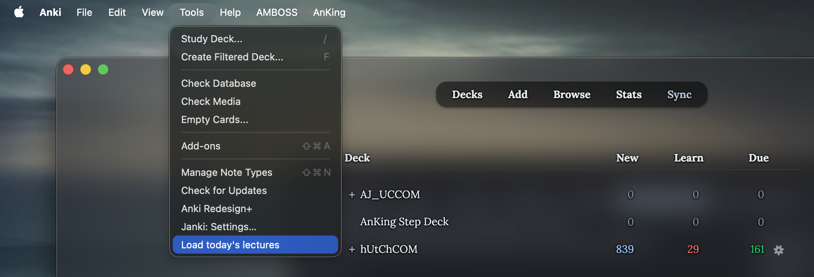
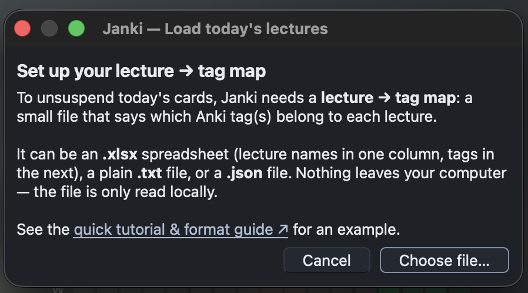
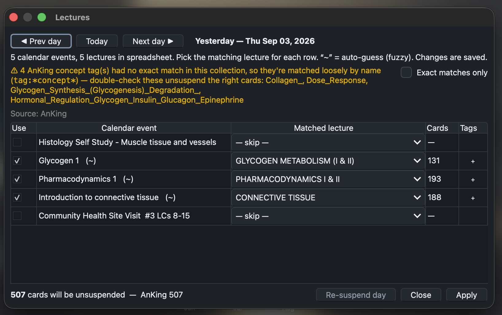
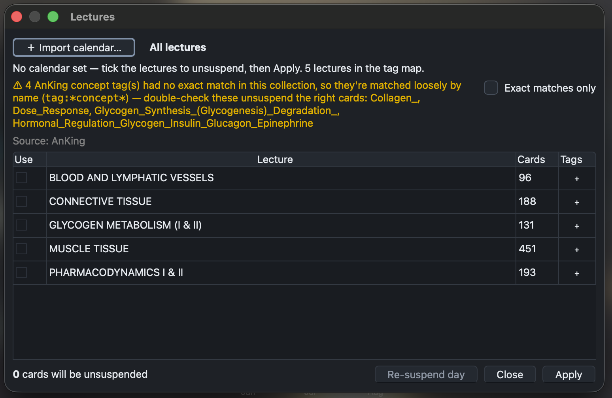
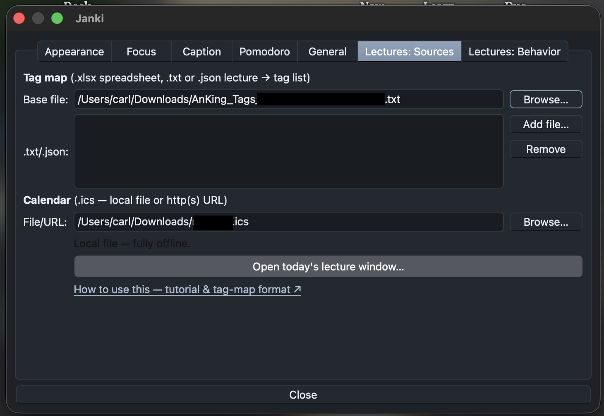

# Load Today's Lectures

*Unsuspend the Anki cards for today's lectures, offline, in one click.*

It matches your schedule to your cards and **unsuspends** the ones for today's
lectures. Everything runs **locally** — nothing is uploaded, and a calendar is
optional. Adds **Tools → Load today's lectures** (in the full Janki add-on or the
standalone `load-todays-lectures.ankiaddon`).

---

## 1. Make a tag map

A **tag map** says which tag(s) belong to each lecture. Easiest form is a `.txt`
file: separate lectures with a line of `====`, put the lecture name between two
rules, then list its tags (lines starting with `#`, `tag:`, or `deck:`).

```text
========================================
Cardiac Cycle & Heart Sounds
========================================
#AK_Step1_v12::#B&B::05_Cardiovascular::Heart_Sounds
tag:AJ_UCCOM_keep::Cardiology::CardiacCycle
```

AnKing (`#AK…`) tags match on their **last segment** (the concept), so they keep
working across deck versions. `.json` and `.xlsx` maps also work — see the format
notes at the bottom.

<!--  -->

---

## 2. First run

**Tools → Load today's lectures** → click **Choose file…** and pick your map.
It's saved for next time.





---

## 3. Pick and apply

The **Lectures** window opens.

**With a calendar** — today's events are pre-matched; use **◀ Prev / Today /
Next ▶** to change day, **Use** to include a row, and the **Matched lecture**
dropdown to fix a wrong guess (`~` = fuzzy auto-guess).



**Without a calendar** — every lecture is listed; just tick what you want. Use
**➕ Import calendar…** (an `.ics` file *or* URL) to switch to day mode.



Also: **+** on a row opens its tags to enable/disable individual ones; **Apply**
unsuspends; **Re-suspend day** undoes the shown day. The amber ⚠ and the **Exact
matches only** checkbox are explained under Settings.

---

## Settings

**Tools → Janki: Settings… → Lectures** (standalone: **… → Settings…**).

- **Base file** + extra **`.txt/.json`** lists (merged on top of the base).
- **Calendar** — optional `.ics` file or URL.
- **Run automatically on launch** — once/day, silently loads today (needs a
  calendar).
- **Exact matches only** — a checkbox by the amber ⚠ in the Lectures window. By
  default an AnKing concept with no exact tag in your collection is matched
  loosely (`tag:*concept*`); tick this to use exact tags only.



---

## Troubleshooting

- **"Couldn't load any lectures."** — check the `.txt` `====`/tag lines, or that
  the `.json` is valid.
- **Wrong match.** — fix with the row's dropdown, or raise **Fuzzy match cutoff**.
- **Nothing on launch.** — auto-run needs a calendar and fires once/day; run it by
  hand from the menu anytime.

Details are logged to `janki-lectures.log` in the add-on folder.

---

### `.json` format

Object (lecture → tag(s)) or a list of `{name, tags}` objects — same tag syntax
as `.txt`:

```json
{ "Cardiac Cycle": ["#AK_Step1_v12::#B&B::05_Cardiovascular::Heart_Sounds"] }
```

*Your schedule and collection stay on your machine; the network is only touched
if you give it an `http(s)` calendar URL.*
