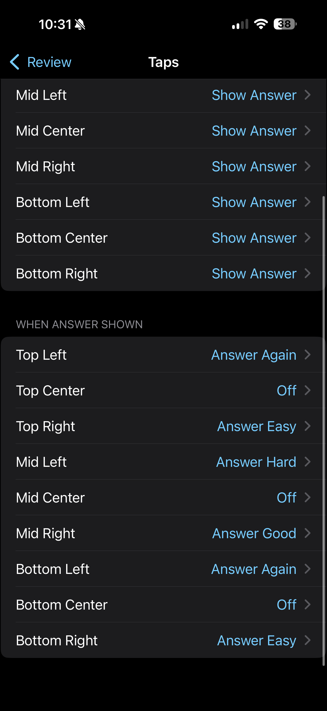

# Mobile cards — stamp Janki's look onto AnkiMobile / AnkiDroid

*AnkiMobile and AnkiDroid can't run add-ons, so Janki bakes its look
(OLED-dark background, serif font, and the text-reveal animation) directly into
your note types. Because the styling lives in the note templates, it rides your
normal sync to the phone/iPad — no add-on needed on the device.*

---

## 1. Apply it (on desktop)

1. Set `"mobile_cards": true` in the add-on config (or it's already on if you
   enabled it), which reveals the menu entry.
2. **Tools → Janki: Mobile cards → Apply** — this rewrites every note type's
   styling. Your originals are saved locally first; **Remove** restores them
   exactly.
3. **Sync.** The new look reaches your devices on their next sync.

Font and the tap-feedback ripple are configurable under
**Settings → Appearance** (Mobile card font / Tap feedback).

---

## 2. Recommended AnkiMobile settings (on the phone)

For the intended full-screen, distraction-free card that matches the desktop
Focus look, change two things in AnkiMobile:

### Disable the Top Bar & Bottom Bar
**Settings → Review** → turn **off** *Top Bar* and *Bottom Bar*. This drops the
toolbar/answer-bar chrome so the OLED-dark card fills the screen.

### Grade by tap position
**Settings → Review → Taps.** Before the answer is shown, every zone is set to
**Show Answer** (tap anywhere to flip). Once the answer is shown, the zones map
to grades by position — so you rate a card by *where* you tap:

- **Before answer (all zones):** Show Answer
- **When answer shown:** Top Left = Again · Top Right = Easy · Mid Left = Hard ·
  Mid Right = Good · Bottom Left = Again · Bottom Right = Easy · centers = Off

This pairs with the tap-feedback ripple so the whole review flow is one-handed
taps, no reaching for the answer buttons.

> Everything here is reversible: **Tools → Janki: Mobile cards → Remove** on
> desktop restores your original note styling, and the AnkiMobile settings are
> just toggles you can flip back.
