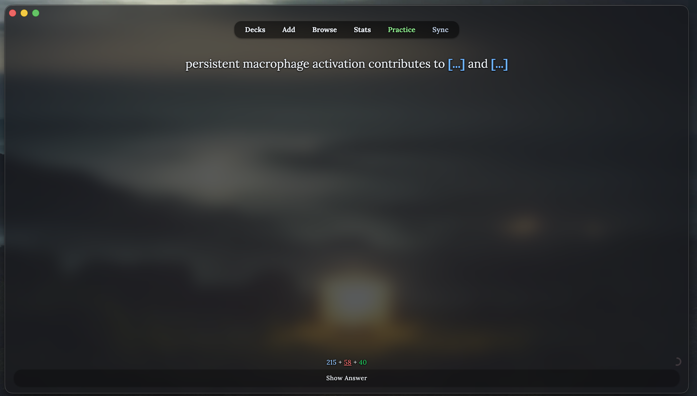
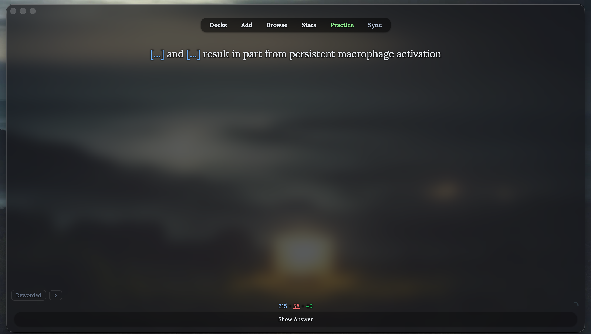

# Rephrase — study the same card in different words

*Janki can show a card **reworded** — the same fact phrased differently — so you
learn the concept instead of pattern-matching a string of text. The rephrase is
**display-only**: it never touches scheduling, intervals, or grading, and every
rephrase lives under the **same** card, so getting the reworded version right
counts exactly like getting the original right. Generation can be 100% local or imported from an agent of your choice (suggested).

  
  

*Left: the card as written. Right: the same card reworded (note the **Reworded**
toggle bottom-left, with a **›** arrow to cycle to the next wording). Cloze
deletions, formatting, and images are preserved; only the phrasing changes.*

---

## What it does

- **Same card, new words.** The reworded text is swapped in at display time. The
  scheduler only ever sees the original card, so due counts, intervals, and your
  grade are identical whether you read the original or a rephrase.
- **Easily switch back.** A small **Original / Reworded** toggle sits in the
  bottom-left corner (styled to match the Practice "show original slide" button).
  In the original view it stays hidden until you hover near it or press
  **`Tab + R`**, so it never clutters a fresh card.
- **Multiple wordings.** If a card has more than one rephrase, a **›** arrow
  appears next to the toggle to cycle through them. View swaps fade in and out.
- **Faithful.** Cloze blanks (`[...]`), bold/lists/other formatting, and any
  images are carried across; only the wording is rewritten.

---

## The main way — bring your own AI (`.rp`)

The highest-quality rephrases come from pasting wording out of any capable AI.
Janki gives you a ready-made prompt and a tolerant importer, so no card content
ever leaves your machine except the text you personally paste.

Open **Tools → Janki: Settings → Rephrase**.

1. **Copy rephrase prompt…** — opens a deck picker where you check which decks to
   pull from and set a batch size (max cards per prompt). It copies a
   ready-to-paste prompt to your clipboard. "Skip cards already done" avoids
   re-generating ones you've already imported.
2. **Paste it into any AI** (a chat model, a local model — your choice) and let it
   return the reworded cards.
3. **Import** the result:
   - **Import (.rp)…** — pick a saved file (`.rp`, `.json`, `.txt`, `.rtf`,
     `.md`). The parser is deliberately forgiving: it handles messy or
     plaintext JSON, code fences, prose around the JSON, and even salvages
     malformed output, and it reports how many cards were imported vs. skipped
     (and why).
   - **Import from clipboard** — same parser, straight from what you copied.

For large sets, paste from a **file** rather than into a terminal.

---

## Experimental backup — on-device generation

Janki can also generate rephrases **entirely on your Mac** using Apple's
on-device foundation models (no network). This is kept as an **experimental
backup** — the bring-your-own-AI path above generally produces better wording and
works the same on any machine. If you are a medical student, I would err with caution
using this as from my testing things have been less consistent. I've got it
to a functional level but local-runtime models have a bit of improving to do before I am
confident in suggesting their use here. Details are important and the most advanced
models **truly are important** for language specificity. In my ideal world, everything is ran locally... but I digress.

Under **Tools → Janki: Settings → Rephrase → Experimental backup**, enable
on-device generation to have rephrases prepared in the background as you study, or
use the one-off button to rephrase the current card. The **Reworded** toggle
appears live on the card as soon as a rephrase finishes generating for it.

---

## Managing your rephrases

- **Preview current card…** — see the rephrases stored for the card in front of
  you (shown alongside the original).
- **View all rewords…** — a searchable browser of every stored rephrase, with a
  per-rephrase **×** to delete individual wordings.

Rephrases are stored locally in `user_files/rewords.json` (which survives add-on
updates) and persist across restarts.

> Everything here is local and reversible: on-device generation is off by
> default, imported wording lives only in your own collection's `user_files`, and
> any rephrase can be deleted individually from **View all rewords…**.

---

> [!NOTE]
> AI generated subcards fundamentally lacks the verification and
> intentional phrasing built-in to human phrased content. I have judged that modifying card
> phrasing *how this is implemented* will be useful to me, however, as with all AI
> generated content, I cannot verify that everything generated by this tool will be
> accurate. Please use discretion and use this feature with responsibility. Always
> defer conflicts to human-generated content, or better, ask questions and discuss ideas
> with those who have expertise.
